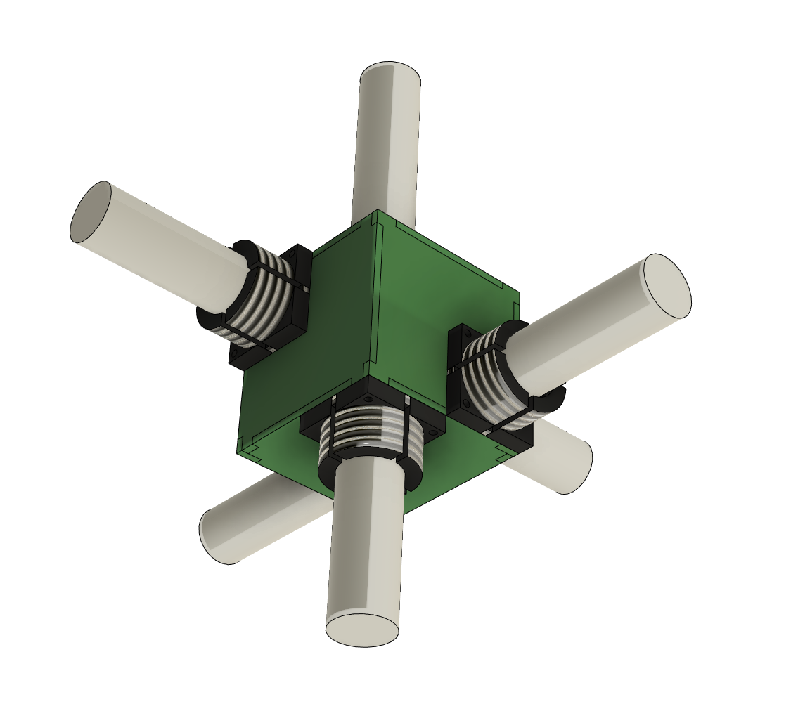
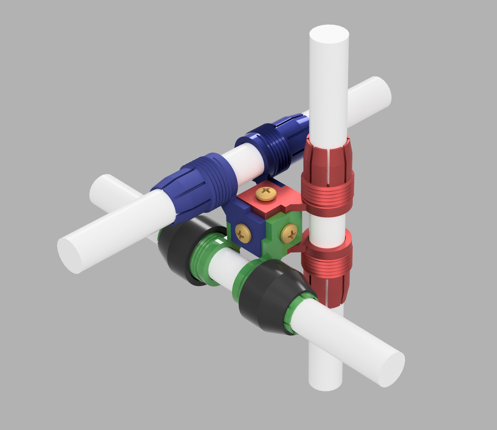
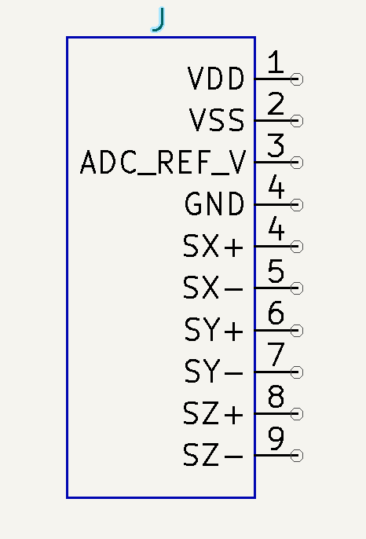

Antenna Design
--------------

Antenna noise estimate
______________________
Initial estimate

.. image:: img/antennaNoiseEstimate.png

After a discussion with Stefan I decided it made sense to increase the power consumption of the amplfier to reduce the noise level. The weight of an extra 18650 to supply the extra power reduces the noise level more than adding an equal amount of copper to all three coils.

Noise at different output senstivity values, V/nT

.. image:: img/Noise_VS_Sensitivity.png

    
Sensitivity 
___________
I have ordered prototype boards and I plan to test them at both 10mV/nT and 50mV/nT. 10mV/nT makes sense for the initial tests in the air to get an idea of what sensitity levels can be tolerated without the signal clipping. 50mV/nT is mnore suitable for the grasshopper use case.

As can be seen from the above graph this the sensitivit effects the noise floor.

It is  possible to make an antenna with variable sensitivity by changing resitance values of several components on the board simultaneously. This is can be done by using adding in paralell resitors to existing ones using CMOS switches. This is probably only worth while if we plan to use one drone to take data both in the air and on the ground. I am not sure if it will add to the noise level or not. If it does it might be more practical to change the configuration depending on the job using solder jumpers/pin sockets, or just using different coils for the different jobs.

My prototypes have the HP roll off at 10Hz. Unlike all of our other antenna this antenna features a 2-pole high pass roll-off. This will make the antenna less prone to clipping due to the motion of the drone.  This is accomplished by using a servo mechanism, similar to how we remove the DC offset in the front of the Ant 5 and Ant6. Except rather than being at a very low frequency it is set to the desired high pass, 10Hz in this case, while the natural corner is set 1.414 times higher, the butterworth coeffiecient for a 2 pole filter. This requires C0G capacitors in the servo to prevent the HP corner from drifting. I have not done this before and is one thing that needs to be tested thoroughly with the prototype boards. On the next version of the board I am going to use 2 solder jumpers so that the board can be configured for the grasshopper mode. If the coil is not moving there is not reason to have 2-pole filter ther, so in grasshopper mode the corner frequency of the servo will be set to 100mHz and the natural corner to 10Hz.

Mechanical Design of Antenna Triplet
------------------------------------
How do we mount the antennas + PCB together? Three requirements are

#. The antennas must all be held orthognally to eachother 

#. The amplifier must be electrostatically shielded from the other electronics on the drone.

#. The leads going from the coil to the amplifier input should ideally be relatively short to minimize capacitance.

One idea of how to do this

This is 6 PCB put together to for a 75mm cube. They would be held togher using either aluminum right angle brackets or 3d printed parts. 

The black components are 3d printed pieces that a plastic nut would go over. The 3d printer is capable of printing threads and this would be used to secure the coils in place. There are other ways to secure things in place if this scheme doesn't work.

The three amplifiers would be located on different sides of the cube. One of the remaining 3 sides  would serve as the interface board with the connector to the ADC. The amplfier PCBS would connect to this board using SMD connectors.

All parts would be surface mount mounted to on the inside of the box. The grounding for shield should not form an electical short around the coil. Boards will need to be 6 layers because there will need to be two dedicated ground layers for shielding. Any gaps in one layer will be covered by the other layer. Any other gaps in the shielding near the edges can be closed with copper foil tape if it proves to be necessary.  

.. image:: img/Ground_plane_overlap.png

2nd Idea for Mechanical Design 
----------------------------------
Put a `Triaxial Mountingt cube <https://www.thorlabs.com/thorproduct.cfm?partnumber=RM1F>`_  from Thor labs at the center to mount 6 3d printed collet style holders onto

Intital concept model

Pin out for connector to ADC
--------------------------------
Initial idea for the connector pinout. Although I am wondering if maybe it makes more sense to generate the ADC reference voltage on the Antenna board so we can just use our existing 8 pin connector.

